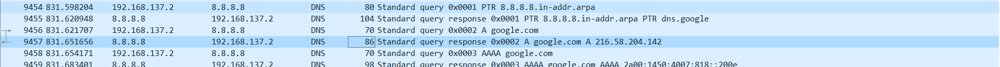

# TP1 - Premier pas réseau

Le terme *réseau* désigne au sens large toutes les fonctionnalités d'un PC permettant de se connecter à d'autres machines.  

Le protocole IP est très important, il est central dans l'utilisation du réseau moderne.

> On va voir IPv4 en cours, il existe aussi IPv6, plus récent, qui fonctionne sur les mêmes principes. Nous en parlerons aussi en cours.

---

Lorsque l'on parle de réseau, on désigne souvent par le terme *client* tout équipement qui porte une adresse IP.

Donc vos PCs sont des *clients*, et on va explorer leur *réseau* dans ce TP.


# Sommaire
- [TP1 - Premier pas réseau](#tp1---premier-pas-réseau)
- [Sommaire](#sommaire)
- [Déroulement et rendu du TP](#déroulement-et-rendu-du-tp)
- [I. Exploration locale en solo](#i-exploration-locale-en-solo)
  - [1. Affichage d'informations sur la pile TCP/IP locale](#1-affichage-dinformations-sur-la-pile-tcpip-locale)
    - [En ligne de commande](#en-ligne-de-commande)
    - [En graphique (GUI : Graphical User Interface)](#en-graphique-gui--graphical-user-interface)
  - [2. Modifications des informations](#2-modifications-des-informations)
    - [A. Modification d'adresse IP (part 1)](#a-modification-dadresse-ip-part-1)
- [II. Exploration locale en duo](#ii-exploration-locale-en-duo)
  - [1. Prérequis](#1-prérequis)
  - [2. Câblage](#2-câblage)
  - [Création du réseau (oupa)](#création-du-réseau-oupa)
  - [3. Modification d'adresse IP](#3-modification-dadresse-ip)
  - [4. Utilisation d'un des deux comme gateway](#4-utilisation-dun-des-deux-comme-gateway)
  - [5. Petit chat privé](#5-petit-chat-privé)
  - [6. Firewall](#6-firewall)
- [III. Manipulations d'autres outils/protocoles côté client](#iii-manipulations-dautres-outilsprotocoles-côté-client)
  - [1. DHCP](#1-dhcp)
  - [2. DNS](#2-dns)
- [IV. Wireshark](#iv-wireshark)
- [Bilan](#bilan)

# Déroulement et rendu du TP

- Groupe de 2 jusqu'à 4 personnes. Il faut au moins deux PCs avec une prise RJ45 (Ethernet) par groupe
- Un câble RJ45 (fourni) pour connecter les deux PCs
- **Un compte-rendu par personne**
  - vu que vous travaillez en groupe, aucun problème pour copier/coller les parties à faire à plusieurs (tout le [`II.`](#ii-exploration-locale-en-duo))
  - une bonne partie est à faire de façon individuelle malgré tout (tout le [`I.`](#i-exploration-locale-en-solo) et le [`III.`](#iii-manipulations-dautres-outilsprotocoles-côté-client))
- Le rendu doit :
  - comporter des réponses aux questions explicites
  - comporter la marche à suivre pour réaliser les étapes demandées :
    - en ligne de commande, copier/coller des commandes et leurs résultat : **JE NE VEUX AUCUN SCREEN DE LIGNE DE COMMANDE**
    - en interface graphique, screenshots ou nom des menus où cliquer (sinon ça peut vite faire 1000 screenshots)
  - par exemple, pour la partie `1.A.` je veux le la commande tapée et le résultat
  - de façon générale, tout ce que vous faites et qui fait partie du TP, vous me le mettez :)

**⚠️ ⚠️ Désactivez votre firewall pour ce TP. ⚠️ ⚠️**

# I. Exploration locale en solo

## 1. Affichage d'informations sur la pile TCP/IP locale

### En ligne de commande

En utilisant la ligne de commande (CLI) de votre OS :

**🌞 Affichez les infos des cartes réseau de votre PC**

```
PS C:\Windows\system32> ipconfig /all

Carte réseau sans fil Wi-Fi :

   Description. . . . . . . . . . . . . . : Intel(R) Wi-Fi 6 AX201 160MHz
   Adresse physique . . . . . . . . . . . : 7C-21-4A-E4-8A-27
   Adresse IPv4. . . . . . . . . . . . . .: 10.33.16.145(préféré)

Carte Ethernet Ethernet :

   Statut du média. . . . . . . . . . . . : Média déconnecté
   Description. . . . . . . . . . . . . . : Killer E2600 Gigabit Ethernet Controller
   Adresse physique . . . . . . . . . . . : B4-45-06-BF-F7-76
```

**🌞 Affichez votre gateway**
```
PS C:\Windows\system32> ipconfig

Carte réseau sans fil Wi-Fi :
   Passerelle par défaut. . . . . . . . . : 10.33.19.254

```

> La passerelle (ou *gateway*), c'est le **routeur** de votre réseau. Pendant que vous réalisez le TP ce sera donc le routeur d'YNOV (ou votre box, si vous faites le TP chez vous). On l'appelle passerelle, car il vous permet de "passer" vers d'autre réseau : Internet en l'occurence :)

**🌞 Déterminer la MAC de la passerelle**
```
PS C:\Windows\system32> arp -a

Interface : 10.33.16.145 --- 0x17
  Adresse Internet      Adresse physique      Type
  10.33.19.254          00-c0-e7-e0-04-4e     dynamique
```
> **La table ARP est aussi appelée table de voisinnage.** Elle contient l'adresse MAC de toutes les personnes avec qui vous avez déjà discuté sur le réseau. La passerelle vous permet d'accéder à Internet donc si vous êtes allés sur Internet, vous avez discuté avec elle !

### En graphique (GUI : Graphical User Interface)

En utilisant l'interface graphique de votre OS :  

**🌞 Trouvez comment afficher les informations sur une carte IP (change selon l'OS)**

```
Panneau de configuration\Réseau et Internet\Centre Réseau et partage\ -> Modifier les paramètre de la carte -> Wi-Fi -> Détails... -> Passerelle par défaut IPv4: 10.33.19.254 
```

> Dans le but de maîtriser votre OS, il est nécessaire de savoir repérer et interagir avec ces informations.

## 2. Modifications des informations

### A. Modification d'adresse IP (part 1)  

🌞 Utilisez l'interface graphique de votre OS pour **changer d'adresse IP** :

```
Panneau de configuration\Réseau et Internet\Centre Réseau et partage\ -> Modifier les paramètre de la carte -> Wi-Fi -> Propriété -> Protocole Internet version 4 (TCP/IPv4) -> Adresse Ip : 10.33.16.252
Masque de sous-réseau : 255.255.252.0
```

🌞 **Il est possible que vous perdiez l'accès internet.** 

On perd l'accès à internet car le réseau n'arrive plus à nous identifier.

---

- **NOTE :** si vous utilisez la même IP que quelqu'un d'autre, il se passerait la même chose qu'en vrai avec des adresses postales :
  - deux personnes habitent au même numéro dans la même rue, mais dans deux maisons différentes
  - quand une de ces personnes envoie un message, aucun problème, l'adresse du destinataire est unique, la lettre sera reçue
  - par contre, pour envoyer un message à l'une de ces deux personnes, le facteur sera dans l'impossibilité de savoir dans quelle boîte aux lettres il doit poser le message
  - ça marche à l'aller, mais pas au retour

# II. Exploration locale en duo

Owkay. Vous savez à ce stade :

- afficher les informations IP de votre machine
- modifier les informations IP de votre machine
- c'est un premier pas vers la maîtrise de votre outil de travail

On va maintenant répéter un peu ces opérations, mais en créant un réseau local de toutes pièces : entre deux PCs connectés avec un câble RJ45.

## 1. Prérequis

- deux PCs avec ports RJ45
- un câble RJ45
- **firewalls désactivés** sur les deux PCs

## 2. Câblage

Ok c'est la partie tendue. Prenez un câble. Branchez-le des deux côtés. **Bap.**

## Création du réseau (oupa)

Cette étape pourrait paraître cruciale. En réalité, elle n'existe pas à proprement parlé. On ne peut pas "créer" un réseau.

**Si une machine possède une carte réseau, et si cette carte réseau porte une adresse IP**, alors cette adresse IP se trouve dans un réseau (l'adresse de réseau). Ainsi, **le réseau existe. De fait.**  

**Donc il suffit juste de définir une adresse IP sur une carte réseau pour que le réseau existe ! Bap.**

## 3. Modification d'adresse IP

🌞 **Modifiez l'IP des deux machines pour qu'elles soient dans le même réseau**

```
Panneau de configuration\Réseau et Internet\Centre Réseau et partage\ -> Modifier les paramètre de la carte -> Ethernet -> Propriété -> Protocole Internet version 4 (TCP/IPv4) -> Adresse Ip : 10.10.10.252
Masque de sous-réseau : 255.255.255.0
```

🌞 **Vérifier à l'aide d'une commande que votre IP a bien été changée**
```
PS C:\Users\lukas> ipconfig

Carte Ethernet Ethernet :

   Suffixe DNS propre à la connexion. . . :
   Adresse IPv6 de liaison locale. . . . .: fe80::f873:b3b2:2572:2ba9%19
   Adresse IPv4. . . . . . . . . . . . . .: 10.10.10.252
   Masque de sous-réseau. . . . . . . . . : 255.255.255.0
   Passerelle par défaut. . . . . . . . . :
```

🌞 **Vérifier que les deux machines se joignent**

```
PS C:\Users\lukas> ping 10.10.10.155

Envoi d’une requête 'Ping'  10.10.10.155 avec 32 octets de données :
Réponse de 10.10.10.155 : octets=32 temps=3 ms TTL=128
Réponse de 10.10.10.155 : octets=32 temps=2 ms TTL=128
Réponse de 10.10.10.155 : octets=32 temps=3 ms TTL=128
Réponse de 10.10.10.155 : octets=32 temps=3 ms TTL=128

Statistiques Ping pour 10.10.10.155:
    Paquets : envoyés = 4, reçus = 4, perdus = 0 (perte 0%),
Durée approximative des boucles en millisecondes :
    Minimum = 2ms, Maximum = 3ms, Moyenne = 2ms
```

> La commande `ping` est un message simple envoyé à une autre machine. Cette autre machine retournera alors un message tout aussi simple. `ping` utilise un protocole frère de IP : le protocole ICMP. On mesure souvent la latence réseau grâce à un `ping` : en mesurant la durée entre l'émission du `ping` et la réception du retour.

🌞 **Déterminer l'adresse MAC de votre correspondant**

```
PS C:\Users\lukas> arp -a

Interface : 10.10.10.252 --- 0x13
  Adresse Internet      Adresse physique      Type
  10.10.10.155          60-18-95-44-10-10     dynamique
```

## 4. Utilisation d'un des deux comme gateway

Ca, ça peut toujours dépann irl. Comme pour donner internet à une tour sans WiFi quand y'a un PC portable à côté, par exemple.

L'idée est la suivante :

- vos PCs ont deux cartes avec des adresses IP actuellement
  - la carte WiFi, elle permet notamment d'aller sur internet, grâce au réseau YNOV
  - la carte Ethernet, qui permet actuellement de joindre votre coéquipier, grâce au réseau que vous avez créé :)
- si on fait un tit schéma tout moche, ça donne ça :

```schema
  Internet           Internet
     |                   |
    WiFi                WiFi
     |                   |
    PC 1 ---Ethernet--- PC 2
    
- internet joignable en direct par le PC 1
- internet joignable en direct par le PC 2
```

- vous allez désactiver Internet sur une des deux machines, et vous servir de l'autre machine pour accéder à internet.

```schema
  Internet           Internet
     X                   |
     X                  WiFi
     |                   |
    PC 1 ---Ethernet--- PC 2
    
- internet joignable en direct par le PC 2
- internet joignable par le PC 1, en passant par le PC 2
```

- pour ce faiiiiiire :
  - désactivez l'interface WiFi sur l'un des deux postes
  - s'assurer de la bonne connectivité entre les deux PCs à travers le câble RJ45
  - **sur le PC qui n'a plus internet**
    - sur la carte Ethernet, définir comme passerelle l'adresse IP de l'autre PC
  - **sur le PC qui a toujours internet**
    - sur Windows, il y a une option faite exprès (google it. "share internet connection windows 10" par exemple)
    - sur GNU/Linux, faites le en ligne de commande ou utilisez [Network Manager](https://help.ubuntu.com/community/Internet/ConnectionSharing) (souvent présent sur tous les GNU/Linux communs)
    - sur MacOS : toute façon vous avez pas de ports RJ, si ? :o (google it sinon)

---

🌞**Tester l'accès internet**

```
PS C:\Users\lukas> ping 8.8.8.8

Envoi d’une requête 'Ping'  8.8.8.8 avec 32 octets de données :
Réponse de 8.8.8.8 : octets=32 temps=24 ms TTL=114
Réponse de 8.8.8.8 : octets=32 temps=69 ms TTL=114
Réponse de 8.8.8.8 : octets=32 temps=21 ms TTL=114
Réponse de 8.8.8.8 : octets=32 temps=24 ms TTL=114

Statistiques Ping pour 8.8.8.8:
    Paquets : envoyés = 4, reçus = 4, perdus = 0 (perte 0%),
Durée approximative des boucles en millisecondes :
    Minimum = 21ms, Maximum = 69ms, Moyenne = 34ms
```

🌞 **Prouver que la connexion Internet passe bien par l'autre PC**

```
PS C:\Users\lukas> tracert 192.168.137.1

Détermination de l’itinéraire vers DESKTOP-URQ404I [192.168.137.1]
avec un maximum de 30 sauts :

  1     1 ms     1 ms    <1 ms  DESKTOP-URQ404I [192.168.137.1]

Itinéraire déterminé.
```

> La commande `traceroute` retourne la liste des machines par lesquelles passent le `ping` avant d'atteindre sa destination.

## 5. Petit chat privé


On va créer un chat extrêmement simpliste à l'aide de `netcat` (abrégé `nc`). Il est souvent considéré comme un bon couteau-suisse quand il s'agit de faire des choses avec le réseau.

Sous GNU/Linux et MacOS vous l'avez sûrement déjà, sinon débrouillez-vous pour l'installer :). Les Windowsien, ça se passe [ici](https://eternallybored.org/misc/netcat/netcat-win32-1.11.zip) (from https://eternallybored.org/misc/netcat/).  

Une fois en possession de `netcat`, vous allez pouvoir l'utiliser en ligne de commande. Comme beaucoup de commandes sous GNU/Linux, Mac et Windows, on peut utiliser l'option `-h` (`h` pour `help`) pour avoir une aide sur comment utiliser la commande.  

Sur un Windows, ça donne un truc comme ça :

```schema
C:\Users\It4\Desktop\netcat-win32-1.11>nc.exe -h
[v1.11 NT www.vulnwatch.org/netcat/]
connect to somewhere:   nc [-options] hostname port[s] [ports] ...
listen for inbound:     nc -l -p port [options] [hostname] [port]
options:
        -d              detach from console, background mode

        -e prog         inbound program to exec [dangerous!!]
        -g gateway      source-routing hop point[s], up to 8
        -G num          source-routing pointer: 4, 8, 12, ...
        -h              this cruft
        -i secs         delay interval for lines sent, ports scanned
        -l              listen mode, for inbound connects
        -L              listen harder, re-listen on socket close
        -n              numeric-only IP addresses, no DNS
        -o file         hex dump of traffic
        -p port         local port number
        -r              randomize local and remote ports
        -s addr         local source address
        -t              answer TELNET negotiation
        -u              UDP mode
        -v              verbose [use twice to be more verbose]
        -w secs         timeout for connects and final net reads
        -z              zero-I/O mode [used for scanning]
port numbers can be individual or ranges: m-n [inclusive]
```

L'idée ici est la suivante :

- l'un de vous jouera le rôle d'un *serveur*
- l'autre sera le *client* qui se connecte au *serveur*

Précisément, on va dire à `netcat` d'*écouter sur un port*. Des ports, y'en a un nombre fixe (65536, on verra ça plus tard), et c'est juste le numéro de la porte à laquelle taper si on veut communiquer avec le serveur.

Si le serveur écoute à la porte 20000, alors le client doit demander une connexion en tapant à la porte numéro 20000, simple non ?  

Here we go :

🌞 **sur le PC *serveur*** avec par exemple l'IP 192.168.1.1
```
C:\Users\lukas\Desktop\netcat-1.11>nc.exe -l -p 8888
Client
Serveur
```

🌞 **sur le PC *client*** avec par exemple l'IP 192.168.1.2

```
C:\Users\lukas\Desktop\netcat-1.11>nc.exe 192.168.137.1 8888
Client
Serveur
```

---

🌞 **Visualiser la connexion en cours**

- sur tous les OS, il existe une commande permettant de voir les connexions en cours
- ouvrez un deuxième terminal pendant une session `netcat`, et utilisez la commande correspondant à votre OS pour repérer la connexion `netcat` :

```bash
# Windows (dans un Powershell administrateur)
$ netstat -a -n -b

# Linux
$ ss -atnp

# MacOS
$ netstat -a -n # je crois :D
```

```
C:\Users\lukas\Desktop\netcat-1.11>netstat -a -n -b

[nc.exe]
  TCP    192.168.137.25:61462   20.54.232.160:443      ESTABLISHED
  CDPUserSvc_ec5778
```

🌞 **Pour aller un peu plus loin**

- si vous faites un `netstat` sur le serveur AVANT que le client `netcat` se connecte, vous devriez observer que votre serveur `netcat` écoute sur toutes vos interfaces
  - c'est à dire qu'on peut s'y connecter depuis la wifi par exemple :D
- il est possible d'indiquer à `netcat` une interface précise sur laquelle écouter
  - par exemple, on écoute sur l'interface Ethernet, mais pas sur la WiFI

```bash
# Sur Windows/MacOS
$ nc.exe -l -p PORT_NUMBER -s IP_ADDRESS
# Par exemple
$ nc.exe -l -p 9999 -s 192.168.1.37
```

```
C:\Users\lukas\Desktop\netcat-1.11>netstat -a -n -b  | findstr 8888
  TCP    0.0.0.0:8888           0.0.0.0:0              LISTENING

C:\Users\lukas\Desktop\netcat-1.11>netstat -a -n -b  | findstr 8888
  TCP    192.168.137.1:8888     0.0.0.0:0              LISTENING
```

## 6. Firewall

Toujours par 2.

Le but est de configurer votre firewall plutôt que de le désactiver

🌞 **Activez et configurez votre firewall**

```
Panneau de configuration\Système et sécurité\Pare-feu Windows Defender -> Paramètres avancés -> Règles du traffic entrant -> Nouvelle règle -> Port -> Protocole et ports -> Ports locaux spécifiques : 8888
Ajout de l'adresse IP dans les propriétés de la règle
```
```
PS C:\Windows\system32> ping 192.168.137.25

Envoi d’une requête 'Ping'  192.168.137.25 avec 32 octets de données :
Réponse de 192.168.137.25 : octets=32 temps=3 ms TTL=128
Réponse de 192.168.137.25 : octets=32 temps=3 ms TTL=128
Réponse de 192.168.137.25 : octets=32 temps=3 ms TTL=128
Réponse de 192.168.137.25 : octets=32 temps=2 ms TTL=128

Statistiques Ping pour 192.168.137.25:
    Paquets : envoyés = 4, reçus = 4, perdus = 0 (perte 0%),
Durée approximative des boucles en millisecondes :
    Minimum = 2ms, Maximum = 3ms, Moyenne = 2ms
```

# III. Manipulations d'autres outils/protocoles côté client

## 1. DHCP

Bon ok vous savez définir des IPs à la main. Mais pour être dans le réseau YNOV, vous l'avez jamais fait.  

C'est le **serveur DHCP** d'YNOV qui vous a donné une IP.

Une fois que le serveur DHCP vous a donné une IP, vous enregistrer un fichier appelé *bail DHCP* qui contient, entre autres :

- l'IP qu'on vous a donné
- le réseau dans lequel cette IP est valable

🌞**Exploration du DHCP, depuis votre PC**

- afficher l'adresse IP du serveur DHCP du réseau WiFi YNOV
- cette adresse a une durée de vie limitée. C'est le principe du ***bail DHCP*** (ou *DHCP lease*). Trouver la date d'expiration de votre bail DHCP
- vous pouvez vous renseigner un peu sur le fonctionnement de DHCP dans les grandes lignes. On aura un cours là dessus :)

```
PS C:\Windows\system32> ipconfig /all

Carte réseau sans fil Wi-Fi :
   Bail expirant. . . . . . . . . . . . . : mercredi 5 octobre 2022 13:30:06
   Serveur DHCP . . . . . . . . . . . . . : 10.33.19.254
```

> Chez vous, c'est votre box qui fait serveur DHCP et qui vous donne une IP quand vous le demandez.

## 2. DNS

Le protocole DNS permet la résolution de noms de domaine vers des adresses IP. Ce protocole permet d'aller sur `google.com` plutôt que de devoir connaître et utiliser l'adresse IP du serveur de Google.  

Un **serveur DNS** est un serveur à qui l'on peut poser des questions (= effectuer des requêtes) sur un nom de domaine comme `google.com`, afin d'obtenir les adresses IP liées au nom de domaine.  

Si votre navigateur fonctionne "normalement" (il vous permet d'aller sur `google.com` par exemple) alors votre ordinateur connaît forcément l'adresse d'un serveur DNS. Et quand vous naviguez sur internet, il effectue toutes les requêtes DNS à votre place, de façon automatique.

🌞** Trouver l'adresse IP du serveur DNS que connaît votre ordinateur**
```
PS C:\Windows\system32> ipconfig /all

Carte réseau sans fil Wi-Fi :

   Serveurs DNS. . .  . . . . . . . . . . : 8.8.8.8
                                       8.8.4.4
                                       1.1.1.1
```
🌞 Utiliser, en ligne de commande l'outil `nslookup` (Windows, MacOS) ou `dig` (GNU/Linux, MacOS) pour faire des requêtes DNS à la main

- faites un *lookup* (*lookup* = "dis moi à quelle IP se trouve tel nom de domaine")
  - pour `google.com`
```
PS C:\Windows\system32> nslookup google.com

Réponse ne faisant pas autorité :
Nom :    google.com
Addresses:  2a00:1450:4007:812::200e
          142.250.179.78
```
  - pour `ynov.com`
```
PS C:\Windows\system32> nslookup ynov.com

Réponse ne faisant pas autorité :
Nom :    ynov.com
Addresses:  2606:4700:20::ac43:4ae2
          2606:4700:20::681a:ae9
          2606:4700:20::681a:be9
          172.67.74.226
          104.26.10.233
          104.26.11.233
```
  - interpréter les résultats de ces commandes
- déterminer l'adresse IP du serveur à qui vous venez d'effectuer ces requêtes
- faites un *reverse lookup* (= "dis moi si tu connais un nom de domaine pour telle IP")
  - pour l'adresse `78.73.21.21`
```
PS C:\Windows\system32> nslookup 78.73.21.21

Nom :    78-73-21-21-no168.tbcn.telia.com
Address:  78.73.21.21
```
  - pour l'adresse `22.146.54.58`
```
PS C:\Windows\system32> nslookup 22.146.54.58

*** dns.google ne parvient pas à trouver 22.146.54.58 : Non-existent domain
```
  - interpréter les résultats
  - *si vous vous demandez, j'ai pris des adresses random :)*

# IV. Wireshark

**Wireshark est un outil qui permet de visualiser toutes les trames qui sortent et entrent d'une carte réseau.**

On appelle ça un **sniffer**, ou **analyseur de trames.**


Il peut :

- enregistrer le trafic réseau, pour l'analyser plus tard
- afficher le trafic réseau en temps réel

**On peut TOUT voir.**

Un peu austère aux premiers abords, une manipulation très basique permet d'avoir une très bonne compréhension de ce qu'il se passe réellement.

➜ **[Téléchargez l'outil Wireshark](https://www.wireshark.org/).**

🌞 Utilisez le pour observer les trames qui circulent entre vos deux carte Ethernet. Mettez en évidence :

- un `ping` entre vous et votre passerelle


- un `netcat` entre vous et votre mate, branché en RJ45


- une requête DNS. Identifiez dans la capture le serveur DNS à qui vous posez la question.



- prenez moi des screens des trames en question
- on va prendre l'habitude d'utiliser Wireshark souvent dans les cours, pour visualiser ce qu'il se passe

# Bilan

**Vu pendant le TP :**

- visualisation de vos interfaces réseau (en GUI et en CLI)
- extraction des informations IP
  - adresse IP et masque
  - calcul autour de IP : adresse de réseau, etc.
- connaissances autour de/aperçu de :
  - un outil de diagnostic simple : `ping`
  - un outil de scan réseau : `nmap`
  - un outil qui permet d'établir des connexions "simples" (on y reviendra) : `netcat`
  - un outil pour faire des requêtes DNS : `nslookup` ou `dig`
  - un outil d'analyse de trafic : `wireshark`
- manipulation simple de vos firewalls

**Conclusion :**

- Pour permettre à un ordinateur d'être connecté en réseau, il lui faut **une liaison physique** (par câble ou par *WiFi*).  
- Pour réceptionner ce lien physique, l'ordinateur a besoin d'**une carte réseau**. La carte réseau porte une adresse MAC  
- **Pour être membre d'un réseau particulier, une carte réseau peut porter une adresse IP.**
Si deux ordinateurs reliés physiquement possèdent une adresse IP dans le même réseau, alors ils peuvent communiquer.  
- **Un ordintateur qui possède plusieurs cartes réseau** peut réceptionner du trafic sur l'une d'entre elles, et le balancer sur l'autre, servant ainsi de "pivot". Cet ordinateur **est appelé routeur**.
- Il existe dans la plupart des réseaux, certains équipements ayant un rôle particulier :
  - un équipement appelé *passerelle*. C'est un routeur, et il nous permet de sortir du réseau actuel, pour en joindre un autre, comme Internet par exemple
  - un équipement qui agit comme **serveur DNS** : il nous permet de connaître les IP derrière des noms de domaine
  - un équipement qui agit comme **serveur DHCP** : il donne automatiquement des IP aux clients qui rejoigne le réseau
  - **chez vous, c'est votre Box qui fait les trois :)**